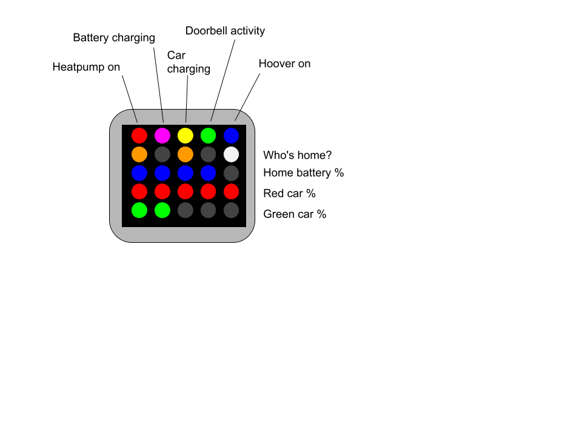
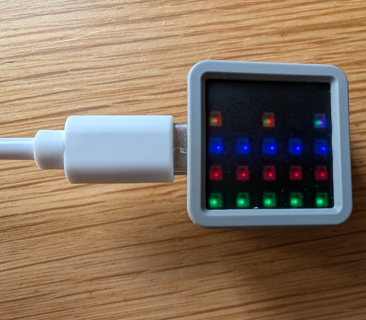

# ESPHome M5Stack Atom Matrix

Notes for my future self on how to build a tiny Home Assistant dashboard out of a [M5Stack Atom Matrix 1.1](https://docs.m5stack.com/en/core/Atom-Matrix_v1.1), which is a ESP32 development board which has:

- Wifi
- a 5x5 matrix of colour LEDs
- a button (press the screen)
- other IO (not used on this project)

The idea was to show the status of various smart home devices by illuminating the LEDs:

- Is the heatpump on?
- Is the home battery charging?
- Is the car charger charging?
- Is there activity on the doorbell?
- Is the hoover running?
- Who is in the house?

and three simple bar charts showing the state of batteries for:

- the home battery
- car 1
- car 2

## LED map

The LEDs were to illuminate as follows:



## Getting Started

You need a fully functioning Home Assistant setup with some sensors. The YAML below will not work out-of-the-box, but you can use it as a guide on how to make your own. I borrowed heavily from [this blog post](https://www.thoughtasylum.com/2024/04/27/home-assistant-matrix-display-for-indicators/) without which I wouldn't have got anywhere.

In Home Assistant add the ESPHome app: see https://esphome.io/install/getting-started/.

I added followed the "Add Device" flow, to get the device paired with Home Assistant - providing the Wifi name and password. I defined the device as an ESP32 variant, using the M5Stack Atom Lite as the jumping off point (as the M5Stack Atom Matrix wasn't an option).

## USB/Serial Driver

I was running on a Mac an required a [driver](https://ftdichip.com/drivers/vcp-drivers/) to allow cabled connection between the Mac and the M5Stack. This is required for the first flashing of firmware - after that, software updates can be done "over the air".

> It may just be me, but I found that the USB C -> USB A cable I was using didn't work. It only worked with a USB C -> USB C cable. I lost a lot of time finding this out.

## Button

The first thing I created was a binary sensor to allow the M5Stack's button to be available to Home Assistant:

```yaml
binary_sensor:
  - platform: gpio
    name: "Main Button"
    id: mainbutton
    pin:
      number: 39
      inverted: true
```

Why "39"? The [M5Stack documentation](https://docs.m5stack.com/en/core/Atom-Matrix_v1.1#pinmap) pin map lists GPIO39 as where the button is connected. The "inverted" flag simply swaps the on/off orientation.

With the minimal configuration that the setup wizard provides and the `binary_sensor` config, the device should be auto-discovered in your Home Assistant devices list. Add a device and set up a test automation to do something when the button is pressed.

> At this point, the M5Stack is on your Wifi network can be updated over-the-air, which is much more convenient.

## Sensors

To get data to flow from Home Assistant back to the M5Stack we need more YAML markup to define which Home Assistant entities we need access to. These could be binary sensors, text sensors or just "sensor"s (numeric values).

### Binary sensors

The on/off flags are added to our `binary_sensor` block, but this time the `platform` is `homeassistant` indicating that data originates from HA and is sent to the M5Stack:

```yaml
# Binary Sensors
binary_sensor:
  - platform: gpio
    name: "Main Button"
    id: mainbutton
    pin:
      number: 39
      inverted: true
  - platform: homeassistant
    id: "heatpump_is_on"
    entity_id: input_boolean.heatpump_is_on
  - platform: homeassistant
    id: "battery_is_charging"
    entity_id: input_boolean.battery_is_charging
  - platform: homeassistant
    id: "ohme_is_charging"
    entity_id: input_boolean.ohme_is_charging
  - platform: homeassistant
    id: "doorbell_activity_boolean"
    entity_id: input_boolean.doorbell_activity_boolean
```

### Text sensors

We also need some text sensors from Home Assistant, whose values we need to know about

```yaml
text_sensor:
  - platform: homeassistant
    id: phone1
    entity_id: device_tracker.phone1
  - platform: homeassistant
    id: phone2
    entity_id: device_tracker.phone2
  - platform: homeassistant
    id: phone3
    entity_id: device_tracker.phone3
  - platform: homeassistant
    id: henry
    entity_id: vacuum.henry
  - platform: homeassistant
    id: ohmestatus
    entity_id: sensor.ohme_home_pro_status
```

### (Numeric) sensors

The "sensors" are just Home Assistant sensors that resolve to numbers, like states of charge of various batteries:

```yaml
sensor:
  - platform: homeassistant
    id: "car1_battery"
    entity_id: sensor.car1_battery_soc
  - platform: homeassistant
    id: "car2_battery"
    entity_id: sensor.car2_battery_soc
  - platform: homeassistant
    id: "house_battery"
    entity_id: sensor.house_battery_soc
```

## Lights

Borrowing from the [blog post](https://www.thoughtasylum.com/2024/04/27/home-assistant-matrix-display-for-indicators/), we need to configure how the LED lights are controlled with the [ESPHome Light Component](https://esphome.io/components/light/):

```yaml
# Lights
light:
  # LED Matrix as a strip
  - platform: esp32_rmt_led_strip
    channel_colors: GRB
    pin: GPIO27
    num_leds: 25
    chipset: ws2812
    name: led_matrix_light
    id: led_matrix_light
    color_correct: [30%, 30%, 30%]
```

Pin 27 corresponds to the GPIO used to control the lights on the [M5Stack pin map](https://docs.m5stack.com/en/core/Atom-Matrix_v1.1#pinmap). The LEDs at full brightness are too bright, so 30% was fine for indoor use. The `WS2812` is the type of LED controller on the M5Stack Atom Matrix. 

## Display

To use the 5x5 matrix of LEDs a display to draw things on, we need to use the [ESPHome Display component](https://esphome.io/components/display/):

```yaml
# Displays
display:
  # LED Matrix as an addressable grid
  - platform: addressable_light
    id: led_matrix_display
    addressable_light_id: led_matrix_light
    width: 5
    height: 5
    rotation: 270
    update_interval: 1000ms
    lambda: |-
      // Define available colours
      Color Red = Color(0xFF0000);
      Color Green = Color(0x00FF00);
      Color Blue = Color(0x0000FF);
      Color White = Color(0xFFFFFF);
      Color Black = Color(0x000000);
      Color Orange = Color(0xFFA500);
      Color Yellow = Color(0xFFFF00);
      Color Magenta = Color(0xFF00FF);
      Color Cyan = Color(0x00FFFF);
      Color Silver = Color(0xC0C0C0);

      // devices
      if(id(heatpump_is_on).state) {it.line(0, 0, 0, 0, Red);}
      if(id(battery_is_charging).state) {it.line(1, 0, 1, 0, Magenta);}
      if(id(ohme_is_charging).state) {
        it.line(2, 0, 2, 0, Yellow);
      } else if (id(ohmestatus).state == "plugged_in") {
        it.line(2, 0, 2, 0, Silver);
      }
      if(id(doorbell_activity_boolean).state) {it.line(3, 0, 3, 0, Green);}
      if(id(henry).state == "cleaning") {it.line(4, 0, 4, 0, Blue);}

      // people
      if(id(phone1).state == "home") { it.line(0, 1, 0, 1, Orange); }
      if(id(phone2).state == "home") {it.line(2,1, 2, 1, Orange);}
      if(id(phone3).state == "home") {it.line(4, 1, 4, 1, Orange);}
      if(id(phone1).state == "not_home") {it.line(0, 1, 0, 1, Silver);}
      if(id(phone2).state == "not_home") {it.line(2,1, 2, 1, Silver);}
      if(id(phone3).state == "not_home") {it.line(4, 1, 4, 1, Silver);}

      // batteries
      int pixels = (int) round((4*id(car1_battery).get_state())/100);
      if (pixels >= 0 && pixels <= 4) {
        it.line(0,2, pixels, 2, Blue);
      }
      pixels = (int) round((4*id(car2_battery).get_state())/100);
      if (pixels >= 0 && pixels <= 4) {
        it.line(0,3, pixels, 3, Red);
      }
      pixels = (int) round((4*id(house_battery).get_state())/100);
      if (pixels >= 0 && pixels <= 4) {
        it.line(0,4, pixels, 4, Green);
      }
```

The [addressable_light](https://esphome.io/components/display/addressable_light/) display allows cartesian coordinates to be used to draw lines and shapes onto the 5x5 grid. I chose a rotation of `270`, so that the power connector was on the left of the display as I looked at it.

> The `update_interval` was initially 16ms, but I found that adding debug output in the Lambda to be too much at that rate. So I set it to `1000ms` in the end.

The `lambda` is the C++ code that is executed every `update_interval` to decide which LEDs are illuminated using which colours.

The code is a series of `if` statements make decisions based on the Home Assistant entities' states and illuminating LEDs to suit. The battery "progress bars" are just lines created by scaling the 0-100 battery sensors to a 0-4 line length. 

## Debugging

It can be useful to add something into the M5Stack's logs for debugging. I used the following in the Lambda:

```C
ESP_LOGI("soc", "Value of my sensor: %f", id(car1_battery).get_state());
```

## Final result

- nothing happening on the binary sensors
- two people in
- near 100% on all three batteries


